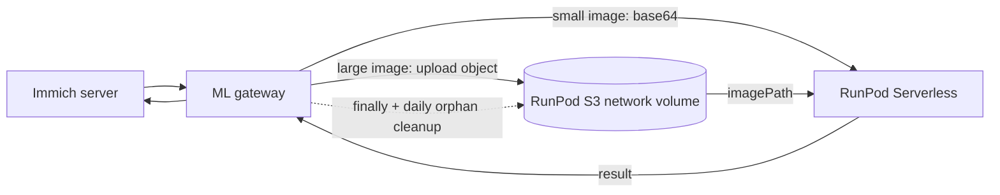
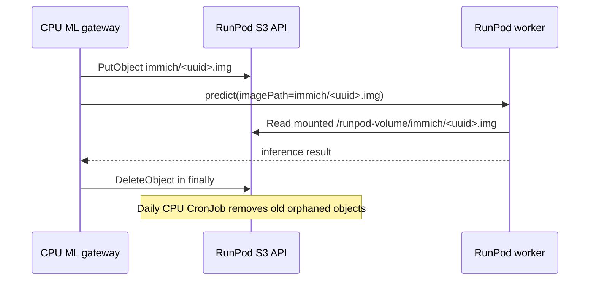

# Immich ML RunPod Worker

RunPod Serverless GPU worker image for the Immich ML gateway.

> AI-generated disclosure: this repository was scaffolded and documented with
> OpenAI Codex under human direction. Treat it as project-specific integration
> code, not as an official Immich or RunPod artifact.

## Status

This repository is public so RunPod can pull the worker image from GHCR without
private registry credentials. Do not add secrets, tokens, customer data, or
private model files to this repository or image.

The worker supports the health operation and an Immich-compatible `predict`
operation for CLIP visual embeddings, face detection/recognition, and OCR.
Unsupported operations return explicit errors.

The Kubernetes gateway is maintained separately in the
[`i3oot/gitops` repository](https://github.com/i3oot/gitops/tree/main/clusters/i3oot.de/apps/immich),
including its [gateway code](https://github.com/i3oot/gitops/blob/main/clusters/i3oot.de/apps/immich/configmap-immich-ml-gateway.yaml),
Deployment, S3 Secret, and CPU cleanup CronJob.

This repo builds a custom worker image on top of:

```text
ghcr.io/immich-app/immich-machine-learning:v3.0.2-cuda
```

The worker is intentionally a thin RunPod handler. Immich itself will not call this endpoint directly. A Kubernetes gateway will translate Immich ML HTTP requests into RunPod jobs and translate RunPod results back into Immich-compatible responses.

## Architecture

Immich does not call this endpoint directly. The Kubernetes gateway translates
Immich's machine-learning HTTP API into RunPod jobs and translates worker
results back into Immich-compatible responses.



For large images the gateway stores a temporary object below `immich/` and
sends only an `imagePath` to this worker. The worker reads the object from
`/runpod-volume/immich/`, performs the inference, and removes the object in a
`finally` block. The gateway also runs a CPU-side daily cleanup for orphaned
objects.

## Supported Operations

### `health`

Input:

```json
{
  "input": {
    "operation": "health"
  }
}
```

Output includes the worker name, configured Immich version, configured cache
path, supported operations, and a Unix timestamp.

### `predict`

The gateway sends the Immich ML pipeline plus either a base64 encoded image or
text. The worker executes the pipeline with the bundled Immich ML runtime and
returns the native Immich response under `result`.

### Unsupported Operations

Any other operation returns:

```json
{
  "ok": false,
  "error": "unsupported_operation"
}
```

This is intentional. New operation adapters should be added only after the
gateway request and response contract is defined.

## Build Locally

```powershell
docker build --platform linux/amd64 -t ghcr.io/i3oot/immich-ml-runpod-worker:v3.0.0-dev .
```

## Test Locally

```powershell
docker run --rm ghcr.io/i3oot/immich-ml-runpod-worker:v3.0.0-dev
```

The RunPod SDK reads `test_input.json` by default for local handler testing.

## Test Without Docker

```powershell
python -m unittest discover -s tests -v
```

## RunPod Endpoint

Create a Serverless endpoint from the published image:

```text
ghcr.io/i3oot/immich-ml-runpod-worker:<version>
```

Recommended endpoint settings:

- Endpoint type: `Queue`
- GPU: `RTX 4090`, `RTX A5000`, or `RTX 3090`
- GPUs per worker: `1`
- Active workers: `0` for scale-to-zero and lowest idle cost
- Max workers: `5` for parallel background jobs
- Idle timeout: `60-300s`
- Execution timeout: `600-1800s`
- FlashBoot: enabled

Environment variables:

```text
IMMICH_VERSION=v3.0.2
WORKER_VERSION=<image-tag>
MODEL_CACHE_DIR=/cache
TRANSFORMERS_CACHE=/cache/transformers
HF_HOME=/cache/huggingface
HF_XET_CACHE=/cache/huggingface-xet
MPLCONFIGDIR=/cache/matplotlib
```

## RunPod S3 Access

RunPod's S3-compatible API is the object interface for a Serverless network
volume. It is not a separate bucket: the network volume ID is the S3 bucket
name, and the same volume is mounted inside each worker at `/runpod-volume`.

See [`docs/s3-access.md`](docs/s3-access.md) for the complete credential,
permission, cleanup, and troubleshooting contract.



### Required values

Keep these values in a secret manager or Kubernetes Secret. Never commit the
access key or secret key to this repository.

| Variable | Meaning |
| --- | --- |
| `RUNPOD_S3_ACCESS_KEY` | RunPod S3 access key / user ID |
| `RUNPOD_S3_SECRET_KEY` | RunPod S3 secret |
| `RUNPOD_S3_ENDPOINT` | Region endpoint, for example `https://s3api-eu-ro-1.runpod.io/` |
| `RUNPOD_S3_REGION` | S3 signing region, for example `EU-RO-1` |
| `RUNPOD_S3_BUCKET` | Network volume ID, for example `i0y2k0bs3u` |
| `RUNPOD_S3_PREFIX` | Temporary object prefix, normally `immich/` |

The access key needs object-level access to the configured volume: list the
temporary prefix and put, get, and delete objects below that prefix. No public
bucket or public object ACL is required.

### AWS CLI smoke test

The RunPod S3 API is path-style S3. With credentials supplied through the
shell environment, use the volume ID as the bucket:

```powershell
$env:AWS_ACCESS_KEY_ID = "<runpod-s3-access-key>"
$env:AWS_SECRET_ACCESS_KEY = "<runpod-s3-secret-key>"
aws s3 ls s3://<network-volume-id>/immich/ `
  --endpoint-url https://s3api-eu-ro-1.runpod.io/ `
  --region EU-RO-1
```

Upload and remove a temporary test object:

```powershell
aws s3 cp .\sample.jpg s3://<network-volume-id>/immich/manual-test.jpg `
  --endpoint-url https://s3api-eu-ro-1.runpod.io/ `
  --region EU-RO-1
aws s3 rm s3://<network-volume-id>/immich/manual-test.jpg `
  --endpoint-url https://s3api-eu-ro-1.runpod.io/ `
  --region EU-RO-1
```

The worker itself does not need S3 credentials. It accesses the same object
through the mounted network volume and validates that `imagePath` stays under
`/runpod-volume/immich/`.

## Network Volume

A RunPod network volume is optional.

Use one when cold starts are too slow because the worker downloads or rebuilds model caches on each fresh worker. The volume gives `/cache` persistent storage across worker restarts in the same region.

Skip it initially when:

- you are testing the endpoint
- the worker image already contains the models you need
- cost matters more than cold-start latency
- the gateway normally uses local/public CLIP and calls RunPod only for rare batch jobs

Mount the network volume at:

```text
/cache
```

Suggested size:

```text
50GiB
```

## Security And Privacy

- Image previews or derived ML inputs may be sent to RunPod once operation
  adapters are implemented.
- The worker image is public. Keep all runtime secrets in RunPod endpoint
  environment variables or Kubernetes secrets, never in this repository.
- S3 credentials belong only in the CPU gateway/CronJob secret. Do not add them
  to the worker image or RunPod template environment.
- Temporary image objects are deleted after each job where possible. The daily
  cleanup job is the recovery path for interrupted requests or crashed workers.
- The current scaffold does not expose an HTTP server; it only runs a RunPod
  Serverless handler.
- Pin immutable image tags such as `sha-<git-sha>` for endpoint deployments.

## Ownership

This is a project-specific integration repository for `i3oot`. It is not
affiliated with or endorsed by Immich, RunPod, or OpenAI.
