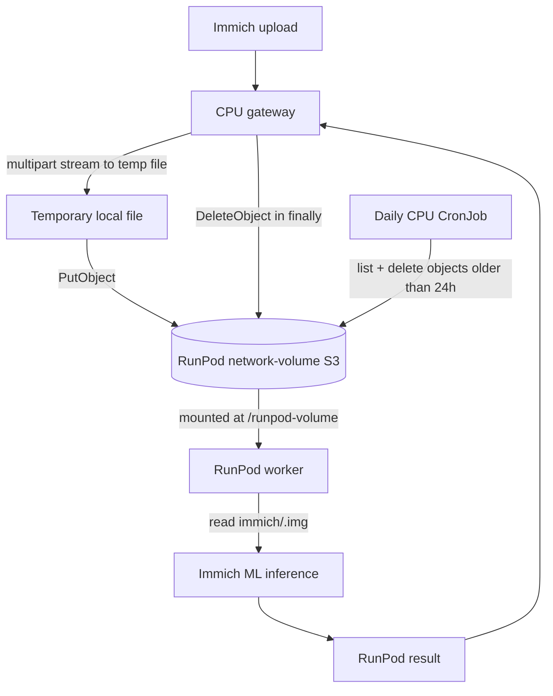

# RunPod S3 access

This document describes the S3-compatible interface used for temporary large
images. It documents the contract and commands, not any credentials.

The gateway and cleanup implementation live in the separate
[`i3oot/gitops` Immich manifests](https://github.com/i3oot/gitops/tree/main/clusters/i3oot.de/apps/immich);
this repository contains only the RunPod worker.

## Data flow



## Configuration contract

The gateway and cleanup job use the following secret values:

```text
RUNPOD_S3_ACCESS_KEY=<RunPod S3 access key>
RUNPOD_S3_SECRET_KEY=<RunPod S3 secret>
RUNPOD_S3_ENDPOINT=https://s3api-eu-ro-1.runpod.io/
RUNPOD_S3_REGION=EU-RO-1
RUNPOD_S3_BUCKET=<network-volume-id>
RUNPOD_S3_PREFIX=immich/
RUNPOD_S3_CLEANUP_MAX_AGE_SECONDS=86400
```

For this integration, the bucket is the RunPod network-volume ID. The object
key is generated below `RUNPOD_S3_PREFIX`, for example:

```text
s3://<network-volume-id>/immich/7f2f...e91.img
/runpod-volume/immich/7f2f...e91.img
```

The S3 API and the worker mount refer to the same underlying volume. The worker
does not use the S3 API credentials.

## Minimum permissions

The credential used by the gateway/CronJob must be able to:

- list objects under `immich/`;
- put temporary objects under `immich/`;
- get access is not needed by the gateway: the worker reads the object through
  the mounted volume;
- delete objects under `immich/`.

Use path-style addressing with the regional endpoint. Do not enable public
access or publish credentials in a Docker image, endpoint template, log, or
repository file.

## CLI verification

```powershell
$env:AWS_ACCESS_KEY_ID = "<runpod-s3-access-key>"
$env:AWS_SECRET_ACCESS_KEY = "<runpod-s3-secret-key>"
$endpoint = "https://s3api-eu-ro-1.runpod.io/"
$region = "EU-RO-1"
$bucket = "<network-volume-id>"

aws s3 ls "s3://$bucket/immich/" --endpoint-url $endpoint --region $region
aws s3 cp .\sample.jpg "s3://$bucket/immich/manual-test.jpg" `
  --endpoint-url $endpoint --region $region
aws s3 rm "s3://$bucket/immich/manual-test.jpg" `
  --endpoint-url $endpoint --region $region
```

The final listing should not contain the manual test object.

## Lifecycle and cleanup

The request path deletes its temporary object in a `finally` block after the
RunPod request completes or fails. A CPU Kubernetes CronJob runs daily with
`concurrencyPolicy: Forbid` and deletes objects older than the configured age,
including objects left behind by a terminated gateway, cancelled job, or
worker crash.

The cleanup job uses the same encrypted Kubernetes Secret as the gateway and is
scheduled only on the CPU worker pool. It paginates `ListObjectsV2`, so it does
not stop after the first 1,000 objects.
